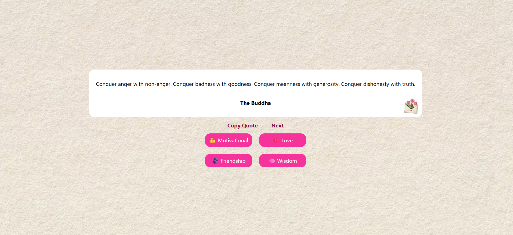

# react-quote-generator

A simple React application that fetches random quotes from an API based on different moods.

## Preview



## Features

- Fetch random quotes from API
- Filter quotes by mood
- Motivational quotes
- Love quotes
- Friendship quotes
- Wisdom quotes
- Copy quote to clipboard
- Loading state while fetching data
- Clean UI using Tailwind CSS

## Technologies Used

- React
- JavaScript (ES6)
- Fetch API
- Tailwind CSS

## API Used

https://api.quotable.io

## Project Structure

```
src
 ├── App.jsx
 ├── assets
 │    └── TulipMailSticker.jpg
public
 └── Img
      └── download.jpg
```

## How It Works

1. User selects a mood category
2. The app sends a request to the Quotable API
3. A random quote is fetched
4. Quote and author are displayed
5. User can copy the quote or fetch a new one

## Installation

Clone the repository

```
git clone https://github.com/ViJaya-kh22/react-quote-generator.git

Install dependencies

```
npm install
```

Run the project

```
npm run dev
```

## Future Improvements

- Add dark mode
- Add animations
- Add share to Twitter feature
- Save favorite quotes

## Author

Built as part of a React learning journey.